# 21V Entra Setup Guide: GitHub EMU SAML Enterprise App and SCIM Sync App Registration

[English](entra-id-app-registration-guide.md) | [简体中文](entra-id-app-registration-guide.zh-cn.md)

This guide targets the China-operated 21V Entra scenario and covers the two implementation steps that are both required for this project:

- Step 1: Create the SAML Enterprise Application used for GitHub Enterprise Managed Users sign-in
- Step 2: Create the App Registration used by this sync project to obtain `client_id`, `client_secret`, and Microsoft Graph access

These two steps are not alternatives. Both must be completed:

- Step 1 handles GitHub EMU SAML authentication
- Step 2 handles Graph token acquisition and user/group data reads for the sync script

This guide focuses on how to obtain and fill the following values:

- `ENTRA_TENANT_ID`
- `ENTRA_CLIENT_ID`
- `ENTRA_CLIENT_SECRET`
- `ENTRA_SYNC_GROUP_NAMES`
- Microsoft Graph application permissions
- The Entra IdP metadata and values required by GitHub SAML

## 1. Understand the two Entra objects

Many implementation mistakes come from mixing up Enterprise Applications and App Registrations. In this project, they have different responsibilities.

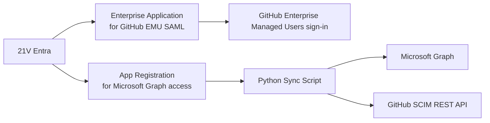


Figure 1-1. Responsibility boundary between Enterprise Application and App Registration

### Responsibility matrix

| Object | Location in Entra | Purpose | Provides Client ID / Secret to this script |
| --- | --- | --- | --- |
| Enterprise Application | Enterprise applications | GitHub EMU SAML SSO | No |
| App Registration | App registrations | Graph access for this project | Yes |

## 2. Overall implementation order

Follow this order to avoid backtracking and configuration confusion.

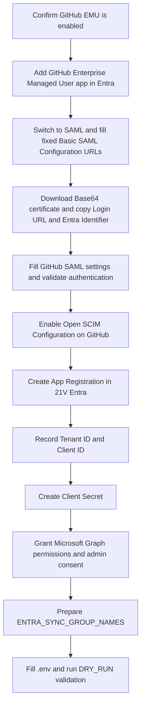

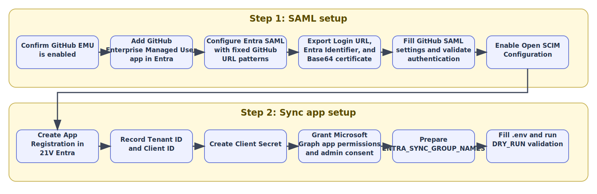

Figure 2-1. Recommended end-to-end implementation sequence

## 3. Prerequisites

Before you begin, confirm the following:

- You can access the 21V Entra admin center: `https://entra.microsoftonline.cn/`
- You have at least one of these roles: `Application Administrator` or `Cloud Application Administrator`
- Your GitHub Enterprise is already enabled for Enterprise Managed Users
- You can access the GitHub enterprise Identity provider configuration page as the setup user or an enterprise owner
- You already know which Entra security groups define the sync scope

## 4. Step 1: Create the SAML Enterprise Application for GitHub EMU sign-in

This step is about how users authenticate to GitHub EMU through Entra SAML. It does not provide Microsoft Graph credentials for this sync script.

### 4.0 Delivery structure for this step

Goal:

- Establish the SAML authentication path between GitHub EMU and 21V Entra
- Validate at least one initial sign-in with a test administrator

Inputs:

- GitHub enterprise slug
- An administrator account that can manage 21V Entra
- A setup user or enterprise owner that can access the GitHub enterprise Identity provider page

Outputs:

- A working GitHub Enterprise Managed User enterprise application
- GitHub filled with Login URL, Issuer, and Public Certificate
- At least one test user assigned to the enterprise application

Checkpoints:

- The Enterprise Application exists in Entra and is switched to SAML
- Open SCIM configuration is enabled on the GitHub side
- The test user is ready for initial sign-in validation

### 4.1 Create the Enterprise Application in 21V Entra

Based on Microsoft Learn's GitHub EMU SAML guide, the correct order is to add the `GitHub Enterprise Managed User` enterprise application in Entra first, not to start by copying values from GitHub.

Recommended flow:

1. Sign in to the 21V Entra admin center
2. Go to `Microsoft Entra ID -> Enterprise applications -> New application`
3. Search for `GitHub Enterprise Managed User`
4. Select `GitHub Enterprise Managed User`
5. Choose `Create` and wait for the application to be added to your tenant

The display name can remain the default one, or you can rename it for readability, for example:

- `GitHub Enterprise Managed User - contoso`
- `GitHub EMU SAML - contoso`

The display name is only for management readability. The fixed URL patterns in the next step are what matter functionally.

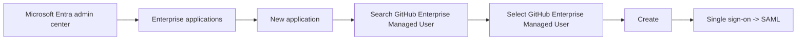


Figure 4-1. Create the GitHub Enterprise Managed User enterprise application from the Entra Gallery

Add a real portal screenshot here to show the gallery search results and the application tile selection:

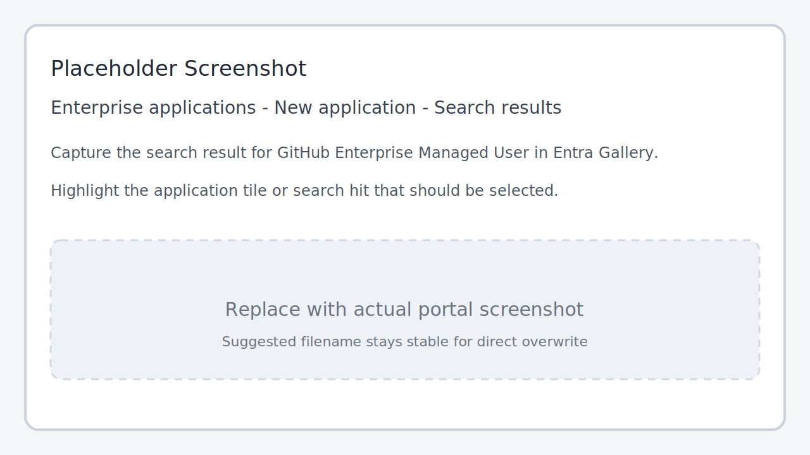

Figure 4-2. Recommended real screenshot: GitHub Enterprise Managed User search result in the Entra Gallery

### 4.2 Switch the Enterprise App to SAML and fill the fixed URL patterns

After the enterprise application is created:

1. Open the Enterprise Application
2. Go to `Single sign-on`
3. Select `SAML`
4. Open `Basic SAML Configuration`

The screenshot below shows where to click `Edit` on the `Basic SAML Configuration` card.

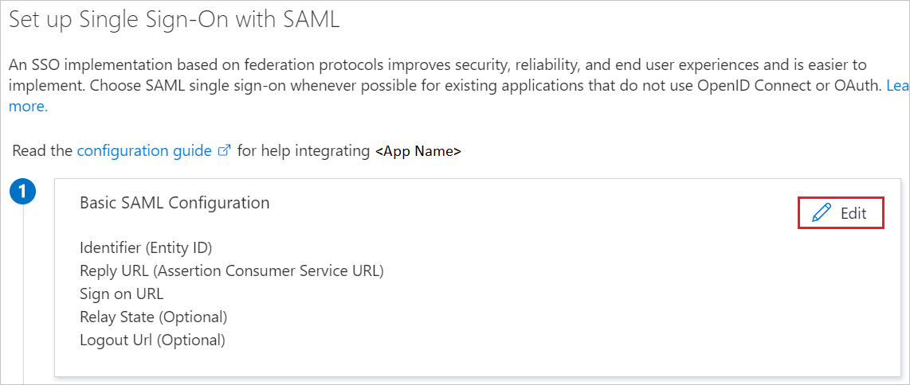

Figure 4-3. Edit entry point for the Basic SAML Configuration card

The three core URLs on this page use fixed GitHub EMU patterns. Do not copy these from GitHub first. Just replace `{enterprise}` with your GitHub enterprise slug.

For example, if your enterprise URL is:

- `https://github.com/enterprises/contoso`

then `{enterprise}` is:

- `contoso`

Fill the values as follows:

| Entra SAML field | Fixed value |
| --- | --- |
| Identifier (Entity ID) | `https://github.com/enterprises/{enterprise}` |
| Reply URL (Assertion Consumer Service URL) | `https://github.com/enterprises/{enterprise}/saml/consume` |
| Sign-on URL | `https://github.com/enterprises/{enterprise}/sso` |

Important notes:

- `Identifier` must not end with a trailing slash `/`
- `Sign-on URL` is mainly for SP-initiated SSO
- Even for initial validation, it is best to fill all three values exactly as documented

### 4.3 Export the Entra SAML outputs and enter them in GitHub

After you complete the fixed SAML URL setup in Entra:

1. Download the `Base64 certificate` from the `SAML Certificates` section
2. Copy the following values from the `Set up GitHub Enterprise Managed User` section:
   - `Login URL`
   - `Microsoft Entra Identifier`
3. Open the SAML configuration page in your GitHub enterprise
4. Enter the Entra outputs into GitHub

The screenshot below shows the `Certificate (Base64)` download location:

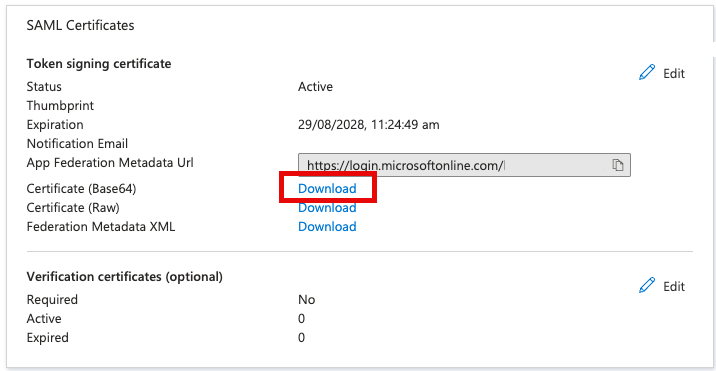

Figure 4-4. Base64 certificate download location

The screenshot below shows the two Entra values that must be copied into GitHub:

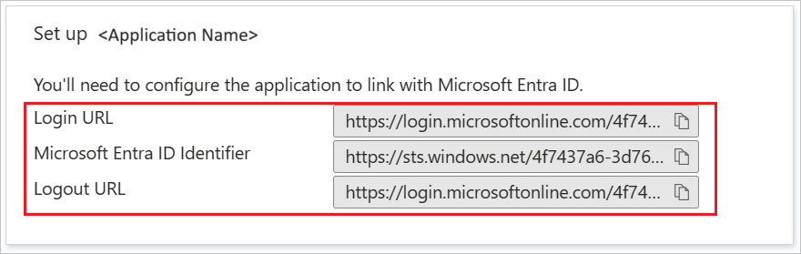

Figure 4-5. Entra SSO values that must be entered in GitHub

Use the following mapping:

| GitHub field | Source |
| --- | --- |
| Sign-on URL | `Login URL` copied from Entra |
| Issuer | `Microsoft Entra Identifier` copied from Entra |
| Public Certificate | The content of the downloaded `Base64 certificate` file |

The distinction between 4.2 and 4.3 is important:

- In 4.2, you fill GitHub EMU fixed SP URL patterns in Entra
- In 4.3, you copy the IdP outputs generated by Entra back into GitHub

Once GitHub is configured with these Entra outputs, the SAML authentication chain is in place.

Add a GitHub-side screenshot here to reduce context switching when the operator fills the values back into GitHub:

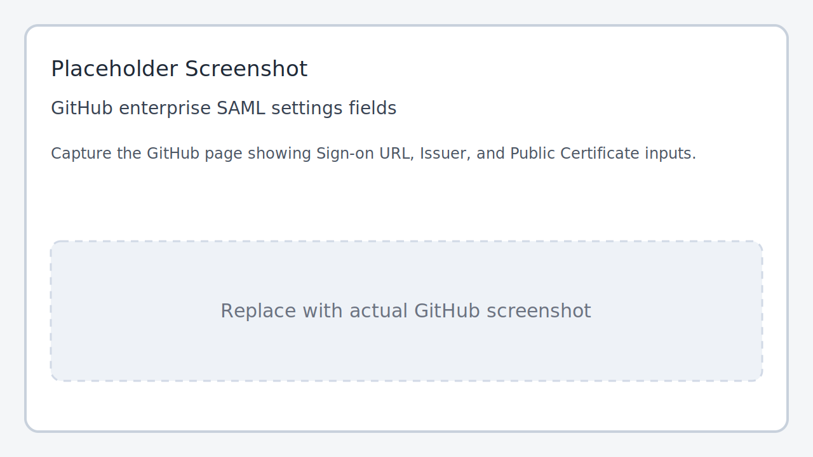

Figure 4-6. Recommended real screenshot: GitHub enterprise SAML settings page with Sign-on URL, Issuer, and Public Certificate fields

### 4.4 Claims and NameID considerations

GitHub EMU SAML authentication must ultimately match the user identity provisioned by SCIM. In this project, the SCIM side mainly uses:

- `externalId` <- Entra `id`
- `userName` <- Entra `userPrincipalName`

SAML guidance:

- Prefer the unique identifier required by GitHub documentation
- Avoid unstable presentation-oriented fields where possible
- Ensure the authentication identifier is compatible with the SCIM matching rules

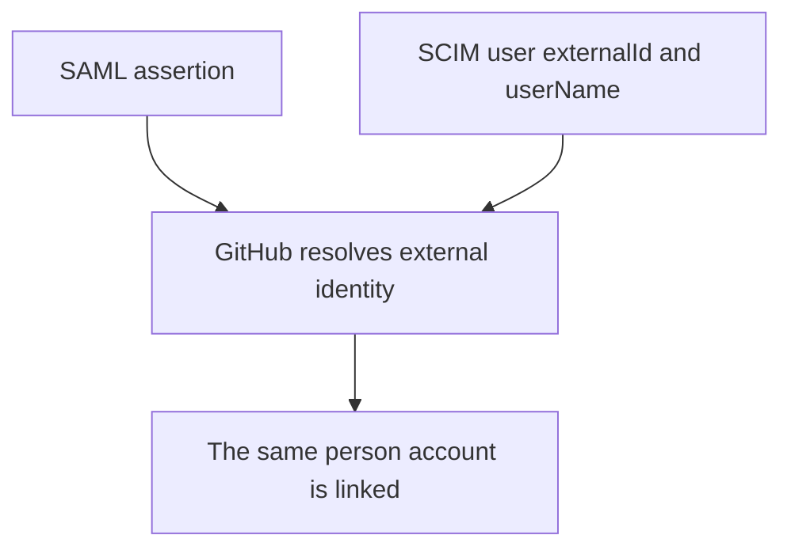


Figure 4-7. How the SAML identity and SCIM identity must align

### 4.5 Assign a test user to the Enterprise Application

After the basic SAML configuration is finished:

1. Go to `Users and groups`
2. Assign a test user
3. Prefer `Enterprise Owner` for the initial admin test user
4. Perform one GitHub sign-in validation

Notes:

- This only controls who can sign in through the Enterprise Application
- It does not define the Graph read scope for this project
- It does not define SCIM provisioning scope by itself

Add a real screenshot here to show the test user assignment and the Enterprise Owner role selection:

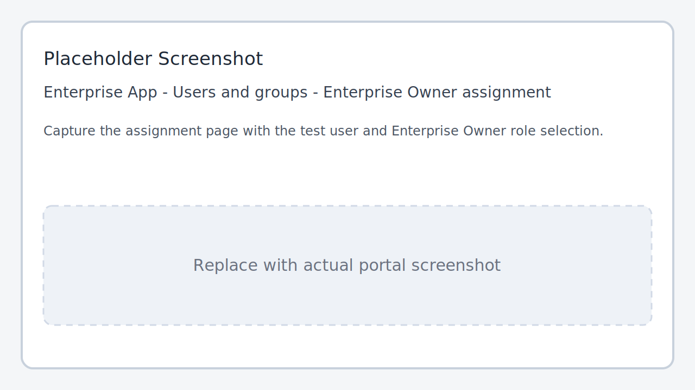

Figure 4-8. Recommended real screenshot: test user assignment with the Enterprise Owner role

### 4.6 Finish the GitHub side of the setup

In the GitHub EMU scenario, both authentication and SCIM have to be completed:

1. Finish the SAML authentication setup
2. Enable `Open SCIM configuration` under `Identity provider -> Single sign-on configuration`

Important GitHub constraints:

- Configure authentication before SCIM
- A custom script using the GitHub SCIM REST API is valid in this project scenario
- Authentication identifiers and provisioning identifiers must remain compatible
- Even if SAML is configured correctly, users still cannot sign in until they are SCIM provisioned

## 5. Step 2: Create the App Registration used by this sync project

This step is for Graph access by the sync script. It is not part of GitHub sign-in.

### 5.0 Delivery structure for this step

Goal:

- Create the App Registration used by the sync script
- Obtain Tenant ID, Client ID, Client Secret, and grant Graph permissions

Inputs:

- The confirmed 21V Entra tenant
- An admin role that can create app registrations and grant admin consent
- The already decided sync group scope

Outputs:

- A working App Registration for the client credentials flow
- ENTRA_TENANT_ID, ENTRA_CLIENT_ID, and ENTRA_CLIENT_SECRET recorded in .env
- Microsoft Graph application permissions granted with admin consent

Checkpoints:

- The token endpoint can issue an access token successfully
- Graph can read direct members and required user fields
- The first DRY_RUN can resolve groups and print the intended changes correctly

### 5.1 Create the App Registration

1. Sign in to the 21V Entra admin center: `https://entra.microsoftonline.cn/`
2. Go to `Microsoft Entra ID -> App registrations -> New registration`
3. Use an application name such as:
   - `emu-scim-sync`
   - `github-emu-sync-daemon`
4. Select `Accounts in this organizational directory only`
5. No web redirect URI is required for this project
6. Select `Register`

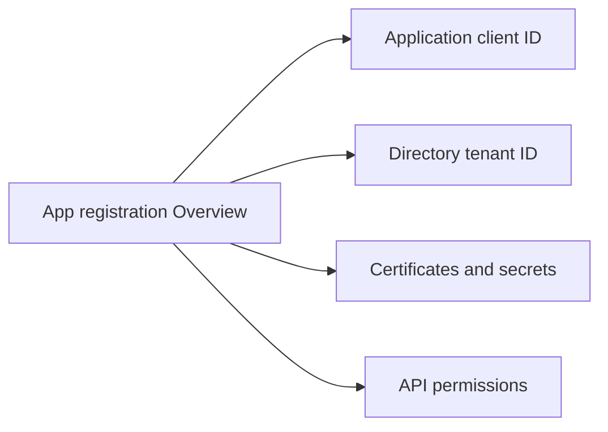


Figure 5-1. Key objects shown on the App Registration overview page

### 5.2 Record Tenant ID and Client ID

On the overview page, record the following values:

| Entra portal field | `.env` field | Description |
| --- | --- | --- |
| Directory (tenant) ID | `ENTRA_TENANT_ID` | Unique Entra tenant identifier |
| Application (client) ID | `ENTRA_CLIENT_ID` | Client identifier used by this sync script |

Example:

```dotenv
ENTRA_TENANT_ID=xxxxxxxx-xxxx-xxxx-xxxx-xxxxxxxxxxxx
ENTRA_CLIENT_ID=xxxxxxxx-xxxx-xxxx-xxxx-xxxxxxxxxxxx
```

Add a real screenshot here to highlight Application (client) ID and Directory (tenant) ID on the Overview page:

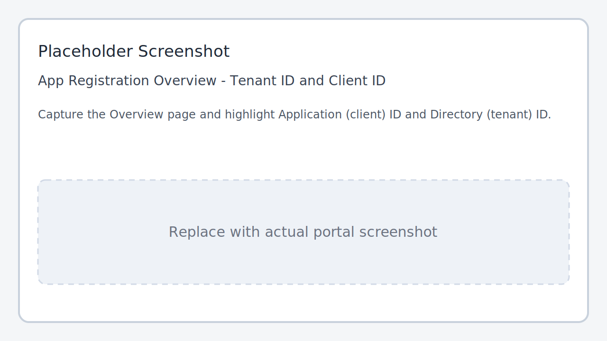

Figure 5-2. Recommended real screenshot: Tenant ID and Client ID on the App Registration Overview page

### 5.3 Create Client Secret

1. Go to `Certificates & secrets`
2. Open `Client secrets`
3. Select `New client secret`
4. Enter a description such as `emu-scim-sync-prod`
5. Choose the expiration period
6. Select `Add`

Important:

- The portal shows both `Secret ID` and `Value`
- You must save the `Value` to `.env`
- Do not use the `Secret ID`

Example:

```dotenv
ENTRA_CLIENT_SECRET=your-secret-value
```

Add a real screenshot here to make it explicit that the operator must copy Value instead of Secret ID:

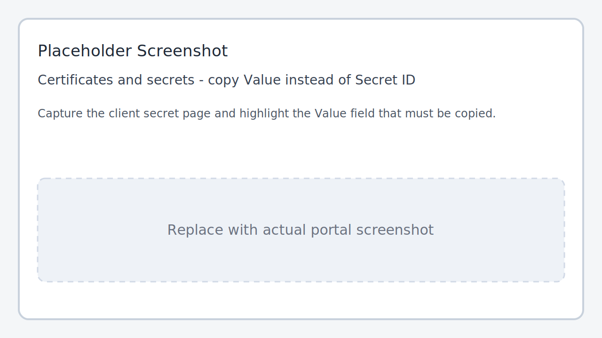

Figure 5-3. Recommended real screenshot: the Value field on the Client Secret page

## 6. Grant Microsoft Graph application permissions

This project reads Entra direct members and user fields such as:

- `id`
- `userPrincipalName`
- `displayName`
- `mail`
- `department`
- `accountEnabled`

The code path is in [src/graph_client.py](../src/graph_client.py).

### 6.1 Recommended minimum permissions

In `API permissions -> Add a permission -> Microsoft Graph -> Application permissions`, add:

1. `GroupMember.Read.All`
2. `User.Read.All`

### 6.2 If fields are still incomplete

If tenant policy prevents some fields from being returned, consider adding:

- `Directory.Read.All`

### 6.3 Grant admin consent

After adding application permissions, you must select:

- `Grant admin consent`

Otherwise, token acquisition may work while Graph reads still fail or return incomplete data.

Add a real screenshot here to show the permission list and the Grant admin consent action:

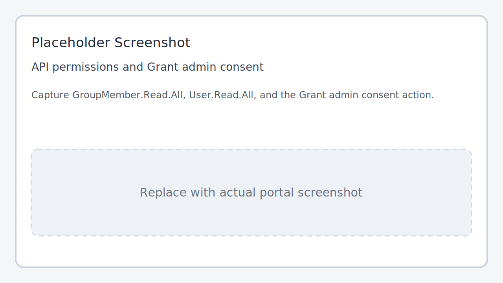

Figure 6-1. Recommended real screenshot: API permissions and Grant admin consent

## 7. Prepare the sync group configuration

### 7.1 Confirm the group display names in Entra

1. Go to `Microsoft Entra ID -> Groups`
2. Find the security groups that define the sync scope
3. Record each group's `displayName`
4. Fill them into `ENTRA_SYNC_GROUP_NAMES`

Example:

```dotenv
ENTRA_SYNC_GROUP_NAMES=GitHub-EMU-Platform,GitHub-EMU-SRE,SanhuaGroup
```

Add a real screenshot here to show the exact group display names used in ENTRA_SYNC_GROUP_NAMES:

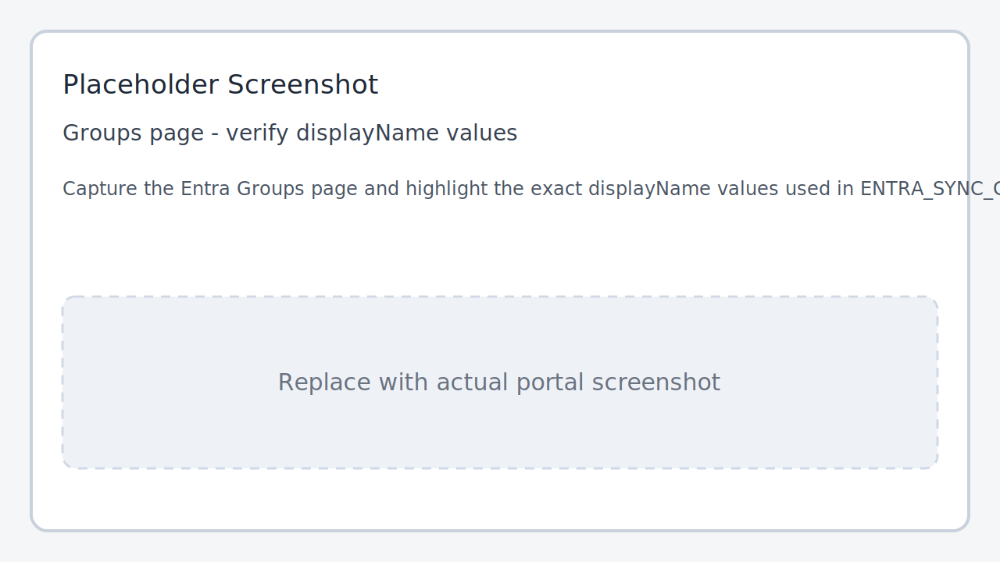

Figure 7-1. Recommended real screenshot: Entra group displayName values used in ENTRA_SYNC_GROUP_NAMES

Important behavior:

- The current implementation resolves groups by display name
- If a name is missing or ambiguous, the script fails closed
- Only direct members are included

## 8. China endpoints and GitHub SCIM requirements

Recommended configuration:

```dotenv
ENTRA_TOKEN_URL=https://login.partner.microsoftonline.cn/{tenant_id}/oauth2/v2.0/token
GRAPH_BASE_URL=https://microsoftgraph.chinacloudapi.cn/v1.0
GITHUB_SCIM_BASE_URL=https://api.github.com/scim/v2/enterprises/{enterprise}
```

GitHub SCIM requirements:

- Use a classic PAT
- Grant `scim:enterprise`
- Always send a non-empty `User-Agent`

## 9. Recommended `.env` example

```dotenv
# General
LOG_LEVEL=INFO
DRY_RUN=true

# Entra ID (21V China)
ENTRA_TENANT_ID=xxxxxxxx-xxxx-xxxx-xxxx-xxxxxxxxxxxx
ENTRA_CLIENT_ID=xxxxxxxx-xxxx-xxxx-xxxx-xxxxxxxxxxxx
ENTRA_CLIENT_SECRET=your-secret-value
ENTRA_TOKEN_URL=https://login.partner.microsoftonline.cn/{tenant_id}/oauth2/v2.0/token
GRAPH_BASE_URL=https://microsoftgraph.chinacloudapi.cn/v1.0
ENTRA_SYNC_GROUP_NAMES=GitHub-EMU-Platform,GitHub-EMU-SRE

# GitHub EMU SCIM
GITHUB_ENTERPRISE=your-enterprise-slug
GITHUB_SCIM_BASE_URL=https://api.github.com/scim/v2/enterprises/{enterprise}
GITHUB_PAT=ghp_xxx
GITHUB_USER_AGENT=emu-scim-sync/0.1
GITHUB_ENTERPRISE_ADMIN_UPNS=admin1@contoso.cn,admin2@contoso.cn

# Local state and logging
STATE_FILE=state/sync_state.json
LOG_FORMAT=text
LOG_FILE=logs/emu_scim_sync.log
LOG_FILE_BACKUP_COUNT=5
```

## 10. Validation sequence

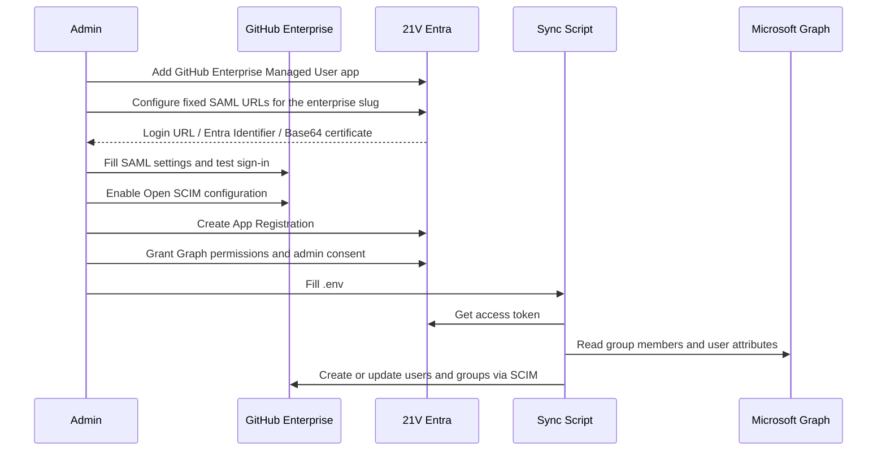

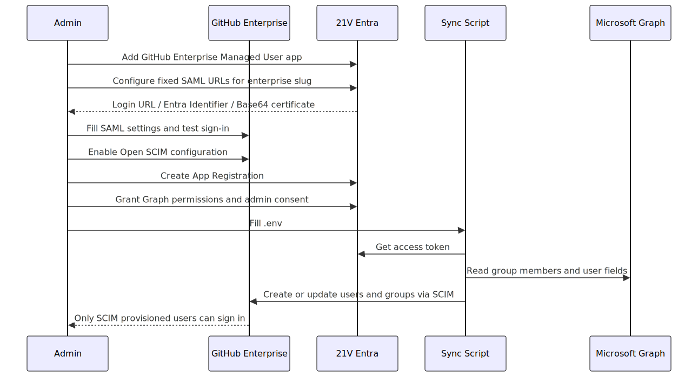

Figure 10-1. Validation sequence across GitHub SSO and SCIM sync

For the first validation, keep:

```dotenv
DRY_RUN=true
```

Only switch to:

```dotenv
DRY_RUN=false
```

after logs confirm that group resolution, user matching, and intended changes are all correct.

## 11. Common issues and troubleshooting

### 11.1 You cannot find `Certificates & secrets`

You are probably looking at:

- Enterprise applications

instead of:

- App registrations

### 11.2 Token endpoint returns 401

Common causes:

- `ENTRA_CLIENT_SECRET` still contains a placeholder
- You used `Secret ID` instead of `Value`
- The secret expired
- `ENTRA_CLIENT_ID` does not match the tenant

### 11.3 Graph returns 403 or incomplete fields

Common causes:

- Application permissions were not granted
- Admin consent was not granted
- Group permissions were added but user read permissions were not

### 11.4 GitHub sign-in opens, but the user is not linked to a provisioned account

Common causes:

- SAML identifier and SCIM matching rules are incompatible
- The user was not provisioned by this sync script yet
- The user is not a direct member of the in-scope groups

### 11.5 GitHub does not show new users

Check the following first:

- `.env` is still not `DRY_RUN=true`
- `GITHUB_PAT` has `scim:enterprise`
- `GITHUB_ENTERPRISE` is correct
- Open SCIM configuration is enabled in the GitHub enterprise

### 11.6 Users exist in groups but are not synchronized

Common causes:

- The user is a nested group member instead of a direct member
- `ENTRA_SYNC_GROUP_NAMES` uses the wrong display name
- Duplicate names cause ambiguous resolution

## 12. Visual completeness and replacement checklist

The guide now has a delivery-ready visual structure with two kinds of assets:

1. Final diagrams or real screenshots that are already ready for readers
2. Placeholder images already inserted at the correct steps and ready to be overwritten with real screenshots

### 12.1 Final diagrams and real screenshots already in place

1. Figure 1-1: Responsibility boundary between the two Entra objects
2. Figure 2-1: Overall implementation sequence
3. Figure 4-1: Enterprise Application creation flow
4. Figure 4-3: Basic SAML Configuration edit entry point
5. Figure 4-4: Base64 certificate download location
6. Figure 4-5: Entra SSO output values
7. Figure 4-7: SAML and SCIM identity linking
8. Figure 5-1: App Registration overview structure
9. Figure 10-1: Validation sequence

### 12.2 Placeholder images to replace with real screenshots

1. Figure 4-2: Entra Gallery search result for GitHub Enterprise Managed User
	Suggested filename: media/entra-id-app-registration-guide/enterprise-app-gallery-search-results-placeholder.svg
2. Figure 4-6: GitHub enterprise SAML settings fields page
	Suggested filename: media/entra-id-app-registration-guide/github-saml-settings-fields-placeholder.svg
3. Figure 4-8: Enterprise App test user assignment with Enterprise Owner role
	Suggested filename: media/entra-id-app-registration-guide/enterprise-app-user-assignment-enterprise-owner-placeholder.svg
4. Figure 5-2: App Registration Overview with Tenant ID and Client ID
	Suggested filename: media/entra-id-app-registration-guide/app-registration-overview-ids-placeholder.svg
5. Figure 5-3: Client Secret page showing the Value field
	Suggested filename: media/entra-id-app-registration-guide/client-secret-value-copy-placeholder.svg
6. Figure 6-1: API permissions and Grant admin consent
	Suggested filename: media/entra-id-app-registration-guide/api-permissions-admin-consent-placeholder.svg
7. Figure 7-1: Entra Groups page with the exact displayName values
	Suggested filename: media/entra-id-app-registration-guide/entra-groups-display-name-placeholder.svg

If you update the Mermaid diagrams later, you can re-render them with:

- `powershell -File scripts/render-entra-id-guide-diagrams.ps1 -Format svg`
- `powershell -File scripts/render-entra-id-guide-diagrams.ps1 -Format both`

## 13. References

Microsoft:

- Enterprise application quickstart: https://learn.microsoft.com/en-us/entra/identity/enterprise-apps/add-application-portal
- App registration quickstart: https://learn.microsoft.com/zh-cn/entra/identity-platform/quickstart-register-app
- Create app and service principal: https://learn.microsoft.com/zh-cn/entra/identity-platform/howto-create-service-principal-portal
- OAuth 2.0 client credentials flow: https://learn.microsoft.com/zh-cn/entra/identity-platform/v2-oauth2-client-creds-grant-flow
- Graph group members permission reference: https://learn.microsoft.com/zh-cn/graph/api/group-list-members?view=graph-rest-1.0
- Configure a GitHub enterprise with Enterprise Managed Users for SAML Single sign-on with Microsoft Entra ID: https://learn.microsoft.com/en-us/entra/identity/saas-apps/github-enterprise-managed-user-tutorial?source=recommendations

GitHub:

- Configure EMU authentication: https://docs.github.com/en/enterprise-cloud@latest/admin/managing-iam/configuring-authentication-for-enterprise-managed-users
- Configure EMU SCIM provisioning: https://docs.github.com/en/enterprise-cloud@latest/admin/managing-iam/provisioning-user-accounts-with-scim/configuring-scim-provisioning-for-enterprise-managed-users
- Provision users and groups with the SCIM REST API: https://docs.github.com/en/enterprise-cloud@latest/admin/managing-iam/provisioning-user-accounts-with-scim/provisioning-users-and-groups-with-scim-using-the-rest-api
- SCIM REST API: https://docs.github.com/en/enterprise-cloud@latest/rest/enterprise-admin/scim

## 14. Related files in this repository

- [src/config.py](../src/config.py)
- [src/graph_client.py](../src/graph_client.py)
- [src/main.py](../src/main.py)
- [src/sync_engine.py](../src/sync_engine.py)
- [README.md](../README.md)
- [README.zh-CN.md](../README.zh-CN.md)
- [.env.example](../.env.example)
