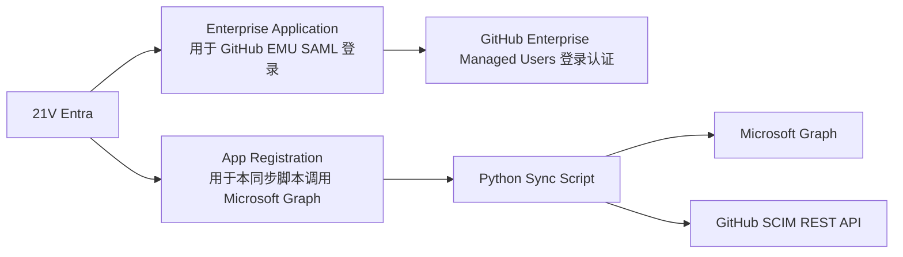
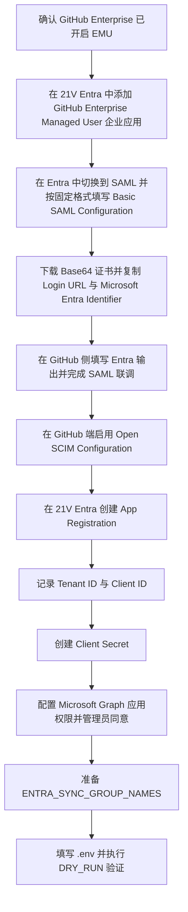
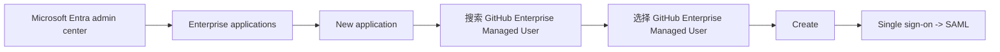
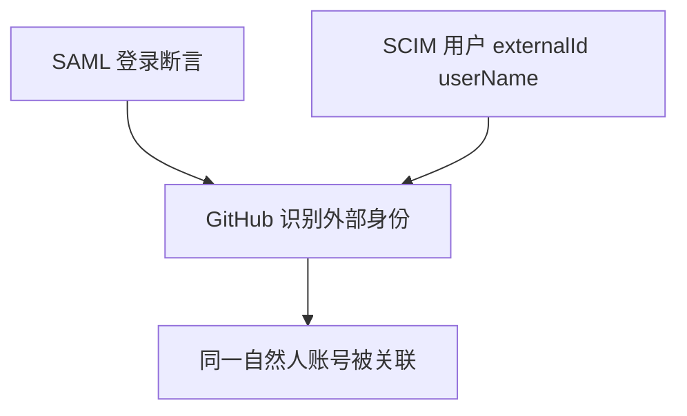
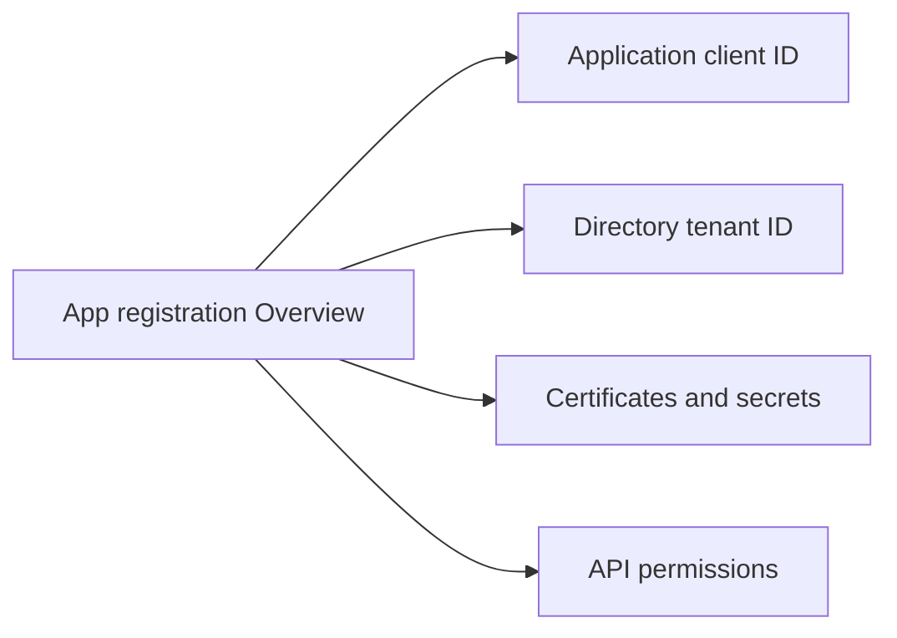
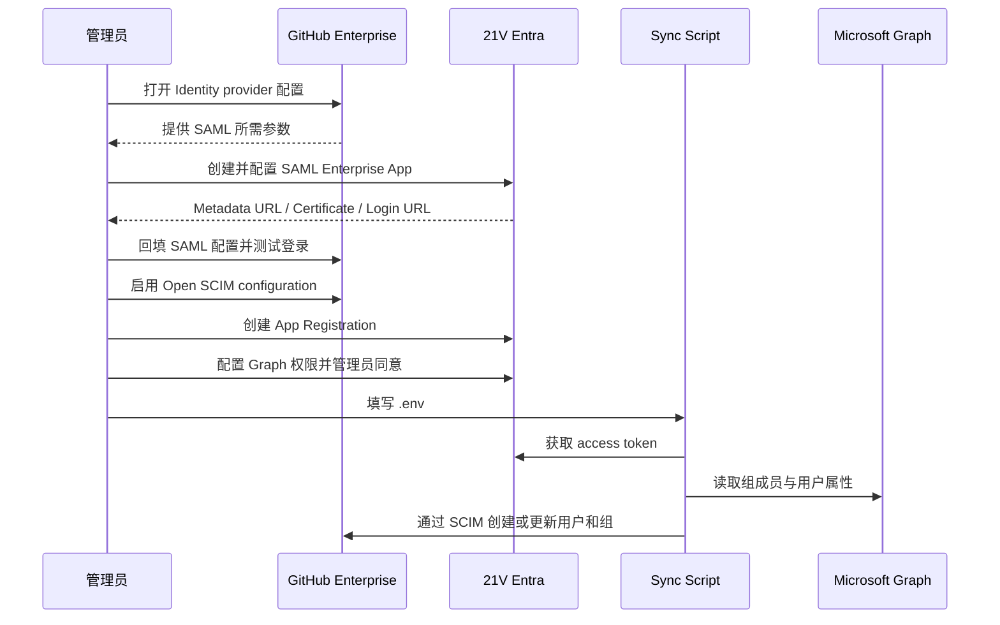

# 21V Entra 配置指南：GitHub EMU 的 SAML Enterprise App 与 SCIM Sync App Registration

[English](entra-id-app-registration-guide.md) | [简体中文](entra-id-app-registration-guide.zh-cn.md)

本文面向当前仓库的中国区场景，覆盖两个都必须完成、且经常被混淆的实施步骤：

- 步骤 1：在 21V Entra 中创建用于 GitHub Enterprise Managed Users 登录的 SAML Enterprise App
- 步骤 2：在 21V Entra 中创建本同步程序使用的 App Registration，用于获取 `client_id`、`client_secret` 并调用 Microsoft Graph

这两个步骤不是二选一关系，而是前后衔接、都必须完成：

- 步骤 1 负责 GitHub EMU 的 SAML 登录认证
- 步骤 2 负责本同步程序获取 Graph token 并读取 Entra 用户与组数据

本文重点说明如何获得并填写以下配置项：

- `ENTRA_TENANT_ID`
- `ENTRA_CLIENT_ID`
- `ENTRA_CLIENT_SECRET`
- `ENTRA_SYNC_GROUP_NAMES`
- Graph API 权限
- GitHub SAML 配置所需的 IdP 元数据和字段

## 1. 先理解两个对象不要混淆

很多实施问题都来自把“企业应用程序”和“应用注册”当成同一个东西。对于当前项目，它们职责不同。




图 1-1. Enterprise Application 与 App Registration 的职责边界

### 职责对照

| 对象 | 在 Entra 中的位置 | 主要用途 | 是否提供 Client ID / Secret 给本脚本 |
| --- | --- | --- | --- |
| Enterprise Application | Enterprise applications | 给 GitHub EMU 做 SAML SSO | 否 |
| App Registration | App registrations | 给本项目拿 token 读 Graph | 是 |

## 2. 总体实施顺序

建议按下面顺序执行，避免重复回填配置。




图 2-1. 建议的端到端实施顺序

## 3. 前置条件

开始前请确认：

- 可以访问 21V Entra 管理中心：`https://entra.microsoftonline.cn/`
- 具备以下至少一种角色：`Application Administrator` 或 `Cloud Application Administrator`
- GitHub Enterprise 已启用 Enterprise Managed Users
- 你能以 enterprise setup user 或 enterprise owner 身份进入 GitHub enterprise 的 Identity provider 配置页
- 已明确本项目要同步的 Entra 组名称，当前支持安全组和分发组

## 4. 步骤 1：新建 SAML Enterprise App，用于 GitHub EMU 登录

这一部分解决“用户如何通过 Entra SAML 登录 GitHub EMU”。它不负责给本同步脚本发 Graph token。

### 4.0 本步骤交付结构

目标：

- 建立 GitHub EMU 到 21V Entra 的 SAML 认证链路
- 让测试管理员先完成一次可验证的 SSO 登录

输入：

- GitHub enterprise slug
- 可登录 21V Entra 的管理员账号
- 可访问 GitHub enterprise Identity provider 页面的 setup user 或 enterprise owner

产出：

- 一个可用的 GitHub Enterprise Managed User 企业应用
- GitHub 侧已填写 Login URL、Issuer、Public Certificate
- 至少一个测试用户已被分配到企业应用

检查点：

- Entra 中可以看到 Enterprise Application 已创建并切换到 SAML
- GitHub 侧已启用 Open SCIM configuration
- 测试用户已具备完成首次登录验证的条件

### 4.1 在 21V Entra 创建 Enterprise Application

根据 Microsoft Learn 的 GitHub EMU SAML 指南，步骤顺序应该先从 Entra 侧添加 GitHub Enterprise Managed User 企业应用，而不是先去 GitHub 侧抄 SAML 参数。

推荐按官方 Gallery 应用执行：

1. 登录 21V Entra 管理中心
2. 进入 `Microsoft Entra ID -> Enterprise applications -> New application`
3. 在搜索框输入 `GitHub Enterprise Managed User`
4. 从结果中选择 `GitHub Enterprise Managed User`
5. 点击 `Create`，等待应用加入当前租户

建议命名可以保留官方默认名称，或者按企业 slug 调整为更容易识别的名称，例如：

- `GitHub Enterprise Managed User - contoso`
- `GitHub EMU SAML - contoso`

这里的显示名称主要影响管理可读性。真正需要按固定格式填写的是下一步 `Basic SAML Configuration` 中的 URL，而不是应用显示名称。

门户路径图：




图 4-1. 从 Entra Gallery 创建 GitHub Enterprise Managed User 企业应用
<!-- TODO(doc-internal): add screenshot figure 4-2 using media/entra-id-app-registration-guide/enterprise-app-gallery-search-results-placeholder.svg; replace with a real Entra Gallery search result screenshot before the next documentation refresh. -->

### 4.2 在 Entra Portal 中切换到 SAML，并按固定格式填写

应用创建完成后：

1. 进入该 Enterprise Application
2. 打开 `Single sign-on`
3. 选择 `SAML`
4. 打开 `Basic SAML Configuration`

下图展示了 `Basic SAML Configuration` 卡片的编辑入口。点击右上角 `Edit` 后，按下面的固定格式填写三个 URL：


图 4-3. Basic SAML Configuration 卡片的编辑入口

这一页需要填写的核心 URL 是固定模式，不是先从 GitHub 页面复制。你只需要把 `{enterprise}` 替换成自己的 GitHub enterprise slug。

例如，如果你的企业地址是：

- `https://github.com/enterprises/contoso`

那么 `{enterprise}` 就是：

- `contoso`

按 Microsoft Learn 的要求填写如下：

| Entra SAML 字段 | 固定格式 |
| --- | --- |
| Identifier (Entity ID) | `https://github.com/enterprises/{enterprise}` |
| Reply URL (Assertion Consumer Service URL) | `https://github.com/enterprises/{enterprise}/saml/consume` |
| Sign-on URL | `https://github.com/enterprises/{enterprise}/sso` |

注意事项：

- `Identifier` 不能带结尾斜杠 `/`
- `Sign-on URL` 主要用于 SP-initiated SSO
- 如果你当前只先做基本联调，也建议把三项都按官方格式填完整

### 4.3 在 Entra Portal 中导出 SAML 输出值

本小节中的操作全部发生在 21V Entra 的 Enterprise Application 页面内，还没有切换到 GitHub。

可以把这一小节理解为“只在 Entra 里拿值，不在这一小节里改 GitHub”。

在 Entra 的 `Set up single sign-on with SAML` 页面完成固定格式配置后：

1. 在 `SAML Certificates` 区域下载 `Base64 certificate`

    下图展示了 `Certificate (Base64)` 的下载位置：

    

    图 4-4. Certificate (Base64) 下载位置

2. 在 `Set up GitHub Enterprise Managed User` 区域复制以下值：
   - `Login URL`
   - `Microsoft Entra Identifier`

    下图展示了需要复制到 GitHub 的两个关键值：

    

    图 4-5. 需要回填到 GitHub 的 Entra SSO 输出值

### 4.4 在 GitHub enterprise 中回填 SAML 配置

本小节中的操作已经从 Entra 切换到 GitHub enterprise 管理页面。你需要把上一小节从 Entra 导出的值，逐项填写到 GitHub 中。

可以把这一小节理解为“离开 Entra，进入 GitHub，只做回填，不再返回 Entra 取值”。

1. 进入 GitHub enterprise 的 SAML 配置页
2. 按下面映射回填 GitHub

| GitHub 配置项 | 来源 |
| --- | --- |
| Sign-on URL | Entra 中复制的 `Login URL` |
| Issuer | Entra 中复制的 `Microsoft Entra Identifier` |
| Public Certificate | 下载的 `Base64 certificate` 文件内容 |

为了避免走错页面，可以把 4.2、4.3、4.4 理解成三段不同职责的动作：

- 4.2 填的是 GitHub EMU 固定格式的 SP URL 模式
- 4.3 导出的是 Entra 生成出来的 IdP 输出值
- 4.4 回填的是把这些 Entra 输出值应用到 GitHub enterprise

完成 GitHub 侧 SAML 配置后，认证链路才算打通。
<!-- TODO(doc-internal): add screenshot figure 4-6 using media/entra-id-app-registration-guide/github-saml-settings-fields-placeholder.svg; replace with a real GitHub SAML settings screenshot. -->

### 4.5 配置声明与 NameID 对齐

GitHub EMU 的 SAML 认证最终要和 SCIM 侧用户建立匹配，因此唯一标识策略必须稳定。对于当前项目，SCIM 侧主要使用：

- `externalId` <- Entra `id`
- `userName` <- Entra `userPrincipalName`

SAML 部分建议：

- 优先使用 GitHub 文档要求的唯一标识字段
- 如果 GitHub 页面没有额外要求，通常应避免使用会频繁变化的展示性字段
- 确保认证侧用户标识与 SCIM 侧匹配规则兼容

可采用如下检查思路：




图 4-7. SAML 认证标识与 SCIM 用户标识的关联关系

### 4.6 在 Entra Portal 中把测试用户分配给 Enterprise App

完成 SAML 基本配置后，还需要给 Enterprise Application 分配用户或组：

1. 进入 `Users and groups`
2. 先分配一个测试用户
3. 在角色选择中，优先给测试管理员分配 `Enterprise Owner`
4. 再执行一次 GitHub 登录验证

注意：

- 这一步只影响“谁能通过该 Enterprise App 做 SAML 登录”
- 不等于本项目的 Graph 读取范围
- 不等于 GitHub SCIM provisioning 范围
<!-- TODO(doc-internal): add screenshot figure 4-8 using media/entra-id-app-registration-guide/enterprise-app-user-assignment-enterprise-owner-placeholder.svg; replace with a real Enterprise Owner assignment screenshot. -->

### 4.7 在 GitHub enterprise 中完成认证后的收尾配置

GitHub EMU 场景下，通常需要把认证和 SCIM 两个阶段都完成：

1. 完成 SAML 认证配置
2. 在 `Identity provider -> Single sign-on configuration` 下启用 `Open SCIM configuration`

GitHub 官方约束要点：

- 先配置认证，再配置 SCIM
- 如果使用非 partner IdP application 的 SCIM 方式，本项目这种“自定义脚本调用 GitHub SCIM REST API”的方式是可行的
- 认证和 provisioning 的唯一标识要兼容，否则登录后无法与已 provision 的账号正确关联
- 即使 SAML 已配置完成，用户也必须先经过 SCIM provision，才能真正登录并访问 enterprise

## 5. 步骤 2：创建本同步程序使用的 App Registration

这一部分是给本项目获取 Graph token 用的，不负责 GitHub 登录。

### 5.0 本步骤交付结构

目标：

- 创建供同步程序使用的 App Registration
- 获取 Tenant ID、Client ID、Client Secret，并完成 Graph 权限授权

输入：

- 已确认的 21V Entra 租户
- 可创建应用注册和执行管理员同意的管理员权限
- 已确定的同步组范围

产出：

- 可用于 client credentials flow 的 App Registration
- 已保存到 .env 的 ENTRA_TENANT_ID、ENTRA_CLIENT_ID、ENTRA_CLIENT_SECRET
- 已完成管理员同意的 Graph Application permissions

检查点：

- Token endpoint 可成功签发 access token
- Graph 可读取目标组 direct members 和用户属性
- DRY_RUN 首次执行时能正确解析组并输出计划变更

### 5.1 打开 App Registration 页面

1. 登录中国区 Entra 管理中心：`https://entra.microsoftonline.cn/`
2. 进入 `Microsoft Entra ID -> App registrations -> New registration`
3. 填写应用名称，例如：
   - `emu-scim-sync`
   - `github-emu-sync-daemon`
4. 建议选择 `Accounts in this organizational directory only`
5. 当前项目不需要 Web redirect URI，可留空
6. 点击 `Register`

创建完成后的结构图：




图 5-1. App Registration 概览页的关键对象结构

### 5.2 获取 Tenant ID 与 Client ID

创建完成后，在概览页记录以下字段：

| Entra 门户字段 | `.env` 字段 | 说明 |
| --- | --- | --- |
| Directory (tenant) ID | `ENTRA_TENANT_ID` | Entra 租户唯一标识 |
| Application (client) ID | `ENTRA_CLIENT_ID` | 当前同步程序的客户端标识 |

示例：

```dotenv
ENTRA_TENANT_ID=xxxxxxxx-xxxx-xxxx-xxxx-xxxxxxxxxxxx
ENTRA_CLIENT_ID=xxxxxxxx-xxxx-xxxx-xxxx-xxxxxxxxxxxx
```
<!-- TODO(doc-internal): add screenshot figure 5-2 using media/entra-id-app-registration-guide/app-registration-overview-ids-placeholder.svg; replace with a real Overview IDs screenshot. -->

### 5.3 创建 Client Secret

1. 进入 `Certificates & secrets`
2. 打开 `Client secrets`
3. 点击 `New client secret`
4. 输入描述，例如 `emu-scim-sync-prod`
5. 选择有效期
6. 点击 `Add`

最容易出错的点：

- 页面会显示 `Secret ID`
- 也会显示 `Value`

你必须保存到 `.env` 的是：

- `Value`

而不是：

- `Secret ID`
- secret 的描述名称

配置示例：

```dotenv
ENTRA_CLIENT_SECRET=your-secret-value
```
<!-- TODO(doc-internal): add screenshot figure 5-3 using media/entra-id-app-registration-guide/client-secret-value-copy-placeholder.svg; replace with a real Client Secret Value screenshot. -->

## 6. 给 App Registration 配置 Microsoft Graph 应用权限

当前项目会从 Entra 组中读取 direct members，并读取这些用户字段：

- `id`
- `userPrincipalName`
- `displayName`
- `mail`
- `department`
- `accountEnabled`

对应代码在 [src/graph_client.py](../src/graph_client.py)。

### 6.1 推荐最小权限起点

进入 `API permissions -> Add a permission -> Microsoft Graph -> Application permissions`，添加：

1. `GroupMember.Read.All`
2. `User.Read.All`

含义：

- `GroupMember.Read.All`：读取组成员关系
- `User.Read.All`：读取用户属性

### 6.2 如果字段仍不完整

如果租户策略导致部分字段仍不可见，可考虑增加：

- `Directory.Read.All`

但建议先从较小权限集合开始。

### 6.3 一定要执行管理员同意

添加应用程序权限后，必须点击：

- `Grant admin consent`

否则你可能会遇到：

- token 可以获取，但 Graph 返回 403
- 返回字段不完整
<!-- TODO(doc-internal): add screenshot figure 6-1 using media/entra-id-app-registration-guide/api-permissions-admin-consent-placeholder.svg; replace with a real API permissions screenshot. -->

## 7. 准备同步组配置

### 7.1 在 Entra 中确认组 displayName

1. 进入 `Microsoft Entra ID -> Groups`
2. 找到要纳入同步范围的 Entra 组，当前支持安全组和分发组
3. 记录这些组的 `displayName`
4. 填入 `ENTRA_SYNC_GROUP_NAMES`

示例：

```dotenv
ENTRA_SYNC_GROUP_NAMES=GitHub-EMU-Platform,GitHub-EMU-SRE,SanhuaGroup
```
<!-- TODO(doc-internal): add screenshot figure 7-1 using media/entra-id-app-registration-guide/entra-groups-display-name-placeholder.svg; replace with a real Entra Groups screenshot. -->

重要语义：

- 当前实现按 displayName 解析目标 Entra 组，支持安全组和分发组
- 如果组名不存在或出现歧义，程序会 fail closed
- 当前仅取 direct members，不展开 nested groups

## 8. 中国区端点与 GitHub 侧关键配置

当前仓库默认面向 21V 中国区，推荐保持如下配置：

```dotenv
ENTRA_TOKEN_URL=https://login.partner.microsoftonline.cn/{tenant_id}/oauth2/v2.0/token
GRAPH_BASE_URL=https://microsoftgraph.chinacloudapi.cn/v1.0
GITHUB_SCIM_BASE_URL=https://api.github.com/scim/v2/enterprises/{enterprise}
```

说明：

- `ENTRA_TOKEN_URL`：中国区 OAuth token endpoint
- `GRAPH_BASE_URL`：中国区 Graph endpoint
- `GITHUB_SCIM_BASE_URL`：GitHub EMU SCIM endpoint

此外 GitHub SCIM 官方还要求：

- 使用 classic PAT
- 具备 `scim:enterprise`
- 请求带非空 `User-Agent`

## 9. 建议的 `.env` 完整示例

```dotenv
# General
LOG_LEVEL=INFO
DRY_RUN=true

# Entra ID (21V China)
ENTRA_TENANT_ID=xxxxxxxx-xxxx-xxxx-xxxx-xxxxxxxxxxxx
ENTRA_CLIENT_ID=xxxxxxxx-xxxx-xxxx-xxxx-xxxxxxxxxxxx
ENTRA_CLIENT_SECRET=your-secret-value
ENTRA_TOKEN_URL=https://login.partner.microsoftonline.cn/{tenant_id}/oauth2/v2.0/token
GRAPH_BASE_URL=https://microsoftgraph.chinacloudapi.cn/v1.0
ENTRA_SYNC_GROUP_NAMES=GitHub-EMU-Platform,GitHub-EMU-SRE

# GitHub EMU SCIM
GITHUB_ENTERPRISE=your-enterprise-slug
GITHUB_SCIM_BASE_URL=https://api.github.com/scim/v2/enterprises/{enterprise}
GITHUB_PAT=ghp_xxx
GITHUB_USER_AGENT=emu-scim-sync/0.1
GITHUB_ENTERPRISE_ADMIN_UPNS=admin1@contoso.cn,admin2@contoso.cn

# Local state and logging
STATE_FILE=state/sync_state.json
LOG_FORMAT=text
LOG_FILE=logs/emu_scim_sync.log
LOG_FILE_BACKUP_COUNT=5
```

## 10. 联调与验证顺序




图 10-1. GitHub SSO 与 SCIM 同步的联调顺序

第一次执行建议始终保持：

```dotenv
DRY_RUN=true
```

只有当日志确认用户识别、组解析和目标变更都正确后，再切换为：

```dotenv
DRY_RUN=false
```

## 11. 常见错误与排查

### 11.1 看不到 `Certificates & secrets`

通常是因为你打开的是：

- Enterprise applications

而不是：

- App registrations

前者用于 SAML 企业应用；后者才是本项目获取 client secret 的地方。

### 11.2 token endpoint 返回 401

常见原因：

- `ENTRA_CLIENT_SECRET` 填的是占位值
- 误用了 `Secret ID` 而不是 `Value`
- secret 已过期
- `ENTRA_CLIENT_ID` 与租户不匹配

### 11.3 Graph 返回 403 或字段不完整

常见原因：

- 没有配置 Application permissions
- 没有执行管理员同意
- 只给了组权限，没有用户读取权限

### 11.4 GitHub 登录能打开，但用户无法正常关联到已 provision 账号

常见原因：

- SAML 侧唯一标识与 SCIM 侧匹配策略不兼容
- 用户尚未被本同步器 provision
- 用户不在同步范围组的 direct members 中

### 11.5 GitHub 没有新增用户

先检查：

- `.env` 是否仍为 `DRY_RUN=true`
- `GITHUB_PAT` 是否具备 `scim:enterprise`
- `GITHUB_ENTERPRISE` 是否正确
- GitHub enterprise 是否已启用 `Open SCIM configuration`

### 11.6 组里有用户但程序没同步

常见原因：

- 用户是 nested group 成员，而不是 direct member
- `ENTRA_SYNC_GROUP_NAMES` 写错 displayName
- 同名组导致解析歧义

## 12. 配图维护说明

当前文档对外仅展示正式流程图和已采集的真实截图，避免把内部待补素材直接暴露给外部读者。

如果后续补充新的真实门户截图，建议优先覆盖以下操作节点：

1. Entra Gallery 中的 GitHub Enterprise Managed User 搜索结果
2. GitHub enterprise SAML 字段回填页
3. Enterprise App 测试用户与 Enterprise Owner 角色分配页
4. App Registration Overview 中的 Tenant ID 与 Client ID
5. Client Secret 页面中的 Value 字段
6. API permissions 与 Grant admin consent 页面
7. Entra Groups 中用于 ENTRA_SYNC_GROUP_NAMES 的 displayName 列表

<!-- Internal screenshot replacement map:
Figure 4-2 -> media/entra-id-app-registration-guide/enterprise-app-gallery-search-results-placeholder.svg
Figure 4-6 -> media/entra-id-app-registration-guide/github-saml-settings-fields-placeholder.svg
Figure 4-8 -> media/entra-id-app-registration-guide/enterprise-app-user-assignment-enterprise-owner-placeholder.svg
Figure 5-2 -> media/entra-id-app-registration-guide/app-registration-overview-ids-placeholder.svg
Figure 5-3 -> media/entra-id-app-registration-guide/client-secret-value-copy-placeholder.svg
Figure 6-1 -> media/entra-id-app-registration-guide/api-permissions-admin-consent-placeholder.svg
Figure 7-1 -> media/entra-id-app-registration-guide/entra-groups-display-name-placeholder.svg
-->

如果后续修改了本文中的 Mermaid 图，可以运行下面的脚本一键重新导出图片：

- `powershell -File scripts/render-entra-id-guide-diagrams.ps1 -Format svg`
- `powershell -File scripts/render-entra-id-guide-diagrams.ps1 -Format both`

## 13. 官方参考

Microsoft 官方：

- Enterprise Application 创建快速开始：https://learn.microsoft.com/en-us/entra/identity/enterprise-apps/add-application-portal
- 应用注册快速开始：https://learn.microsoft.com/zh-cn/entra/identity-platform/quickstart-register-app
- 注册应用并创建服务主体：https://learn.microsoft.com/zh-cn/entra/identity-platform/howto-create-service-principal-portal
- OAuth 2.0 客户端凭据流：https://learn.microsoft.com/zh-cn/entra/identity-platform/v2-oauth2-client-creds-grant-flow
- Graph 组成员接口权限：https://learn.microsoft.com/zh-cn/graph/api/group-list-members?view=graph-rest-1.0
- Configure a GitHub enterprise with Enterprise Managed Users for SAML Single sign-on with Microsoft Entra ID：https://learn.microsoft.com/en-us/entra/identity/saas-apps/github-enterprise-managed-user-tutorial?source=recommendations

GitHub 官方：

- 配置 EMU 认证：https://docs.github.com/en/enterprise-cloud@latest/admin/managing-iam/configuring-authentication-for-enterprise-managed-users
- 配置 EMU SCIM provisioning：https://docs.github.com/en/enterprise-cloud@latest/admin/managing-iam/provisioning-user-accounts-with-scim/configuring-scim-provisioning-for-enterprise-managed-users
- 使用 REST API 进行 SCIM provisioning：https://docs.github.com/en/enterprise-cloud@latest/admin/managing-iam/provisioning-user-accounts-with-scim/provisioning-users-and-groups-with-scim-using-the-rest-api
- SCIM REST API：https://docs.github.com/en/enterprise-cloud@latest/rest/enterprise-admin/scim

## 14. 当前仓库中的相关文件

- [src/config.py](../src/config.py)
- [src/graph_client.py](../src/graph_client.py)
- [src/main.py](../src/main.py)
- [src/sync_engine.py](../src/sync_engine.py)
- [README.md](../README.md)
- [README.zh-CN.md](../README.zh-CN.md)
- [.env.example](../.env.example)
