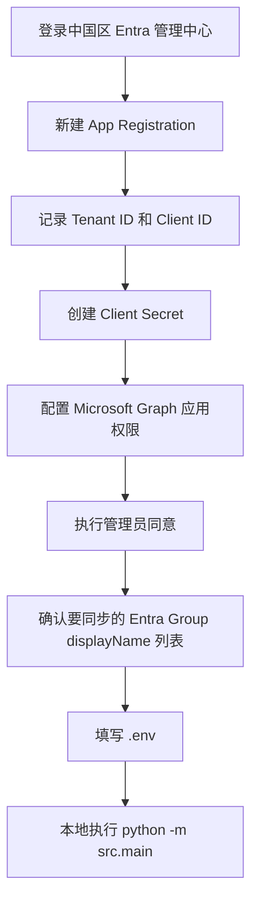
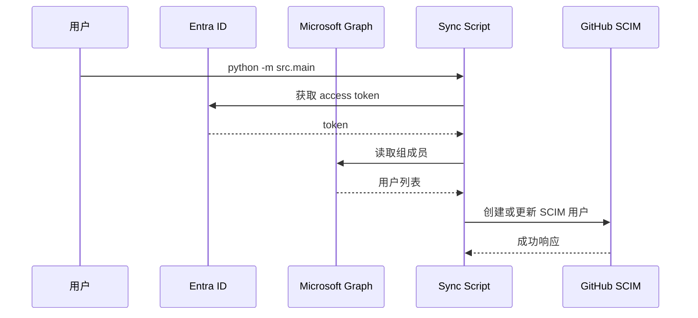

# Entra ID 应用注册与 `.env` 配置指南

本文面向当前仓库的中国区场景，说明如何在 21V Entra ID 中创建用于 GitHub EMU SCIM 同步的应用注册，并获取以下配置项：

- `ENTRA_TENANT_ID`
- `ENTRA_CLIENT_ID`
- `ENTRA_CLIENT_SECRET`
- `ENTRA_SYNC_GROUP_NAMES`
- Graph API 权限

## 1. 总体流程图



## 2. 前置条件

在开始前，请确认：

- 你可以访问中国区 Entra 管理中心：`https://entra.microsoftonline.cn/`
- 你拥有创建应用注册和授予管理员同意的权限
- 你已经准备好一个用于同步的 Entra 安全组
- GitHub Enterprise Managed Users 已启用开放 SCIM 配置

## 3. 创建新的 App Registration

### 3.1 打开应用注册页面

1. 登录中国区 Entra 管理中心：`https://entra.microsoftonline.cn/`
2. 进入：`Microsoft Entra ID -> 应用注册 -> 新建注册`
3. 填写应用名称，例如：
   - `emu-scim-sync`
   - `github-emu-sync-daemon`
4. 建议选择：`仅此组织目录中的帐户`
5. 对本项目来说，不需要配置 Web 重定向 URI，可以留空
6. 点击“注册”

### 3.2 注册后的结果图

```mermaid
flowchart LR
    A[应用注册概览页] --> B[目录(租户) ID]
    A --> C[应用程序(客户端) ID]
    A --> D[证书和机密]
    A --> E[API 权限]
```

## 4. 获取 Tenant ID 与 Client ID

创建完成后，进入应用注册的“概览”页，记录以下两个值：

| Entra 门户字段 | `.env` 字段 | 说明 |
| --- | --- | --- |
| 目录(租户) ID | `ENTRA_TENANT_ID` | 你的 Entra 租户唯一标识 |
| 应用程序(客户端) ID | `ENTRA_CLIENT_ID` | 当前同步程序使用的客户端标识 |

`.env` 示例：

```dotenv
ENTRA_TENANT_ID=xxxxxxxx-xxxx-xxxx-xxxx-xxxxxxxxxxxx
ENTRA_CLIENT_ID=xxxxxxxx-xxxx-xxxx-xxxx-xxxxxxxxxxxx
```

## 5. 创建 Client Secret

### 5.1 创建步骤

1. 在该 App Registration 左侧进入：`证书和机密`
2. 选择：`客户端密码`
3. 点击：`新建客户端密码`
4. 填写描述，例如：`emu-scim-sync-local`
5. 选择有效期
6. 点击“添加”

### 5.2 最重要的注意事项

创建成功后，页面会显示两类信息：

- Secret ID
- Value

你需要写入 `.env` 的是：

- `Value`

不是：

- Secret ID
- 描述名称

### 5.3 `.env` 示例

```dotenv
ENTRA_CLIENT_SECRET=your-secret-value
```

## 6. 配置 Microsoft Graph 权限

当前仓库会读取指定 Entra 组内的用户，并获取这些字段：

- `id`
- `userPrincipalName`
- `displayName`
- `mail`
- `department`
- `accountEnabled`

代码入口在：

- [src/graph_client.py](../src/graph_client.py)

### 6.1 推荐权限

请在 App Registration 中进入：`API 权限 -> 添加权限 -> Microsoft Graph -> 应用程序权限`，添加：

1. `GroupMember.Read.All`
2. `User.Read.All`

这两个权限是当前项目最合适的起点：

- `GroupMember.Read.All`：读取组成员关系
- `User.Read.All`：读取用户完整属性

### 6.2 更宽的兜底权限

如果你的租户策略导致某些用户字段仍返回不完整，可以考虑：

- `Directory.Read.All`

但建议先尝试较小权限集合，再按需放宽。

### 6.3 管理员同意

添加完权限后，必须执行：

- `授予管理员同意`

否则即使令牌可以获取，后续 Graph API 也可能返回 403 或字段不完整。

## 7. 确认同步组名称

### 7.1 门户方式

1. 进入：`Microsoft Entra ID -> 组`
2. 确认你要同步的安全组名称
3. 记录每个目标组的 `名称`（displayName）
4. 将这些名称填写到：`ENTRA_SYNC_GROUP_NAMES`

### 7.2 `.env` 示例

```dotenv
ENTRA_SYNC_GROUP_NAMES=GitHub-EMU-Platform,GitHub-EMU-SRE,SanhuaGroup
```

说明：

- 当前实现按 Entra security group 的 displayName 解析目标组
- 如果某个组名不存在，或同名解析到多个安全组，程序会失败关闭
- 当前范围只取每个组的 direct members，不展开 nested groups

## 8. 中国区端点配置

当前仓库默认已经面向 21V 中国区，推荐保持如下配置：

```dotenv
ENTRA_TOKEN_URL=https://login.partner.microsoftonline.cn/{tenant_id}/oauth2/v2.0/token
GRAPH_BASE_URL=https://microsoftgraph.chinacloudapi.cn/v1.0
```

说明：

- `ENTRA_TOKEN_URL`：中国区 Entra OAuth token endpoint
- `GRAPH_BASE_URL`：中国区 Microsoft Graph endpoint

通常不需要手工修改这两个值。

## 9. `.env` 对照表

推荐最终填写如下：

```dotenv
# General
LOG_LEVEL=INFO
DRY_RUN=true

# Entra ID (21V China)
ENTRA_TENANT_ID=xxxxxxxx-xxxx-xxxx-xxxx-xxxxxxxxxxxx
ENTRA_CLIENT_ID=xxxxxxxx-xxxx-xxxx-xxxx-xxxxxxxxxxxx
ENTRA_CLIENT_SECRET=your-secret-value
ENTRA_TOKEN_URL=https://login.partner.microsoftonline.cn/{tenant_id}/oauth2/v2.0/token
GRAPH_BASE_URL=https://microsoftgraph.chinacloudapi.cn/v1.0
ENTRA_SYNC_GROUP_NAMES=GitHub-EMU-Platform,GitHub-EMU-SRE

# GitHub EMU SCIM
GITHUB_ENTERPRISE=your-enterprise-slug
GITHUB_SCIM_BASE_URL=https://api.github.com/scim/v2/enterprises/{enterprise}
GITHUB_PAT=ghp_xxx
GITHUB_USER_AGENT=emu-scim-sync/0.1
GITHUB_ENTERPRISE_ADMIN_UPNS=admin1@contoso.cn,admin2@contoso.cn

# Local state
STATE_FILE=state/sync_state.json
```

## 10. 验证顺序

建议按以下顺序验证：



第一次验证建议保持：

```dotenv
DRY_RUN=true
```

当日志确认用户识别正确后，再切换为：

```dotenv
DRY_RUN=false
```

## 11. 常见错误与排查

### 11.1 `401 Unauthorized` at token endpoint

常见原因：

- `ENTRA_CLIENT_SECRET` 仍是占位值
- 填错了 Secret ID，而不是 Secret Value
- Secret 已过期
- `ENTRA_CLIENT_ID` 与租户不匹配

### 11.2 Graph 返回 403 或用户字段为空

常见原因：

- 没有给 App Registration 添加应用程序权限
- 没有执行管理员同意
- 只给了组成员权限，没有给用户读取权限

### 11.3 GitHub 侧没有新增用户

先检查：

- `.env` 中是否仍是 `DRY_RUN=true`
- `GITHUB_PAT` 是否具备 `scim:enterprise`
- `GITHUB_ENTERPRISE` 是否是正确的 enterprise slug

### 11.4 找不到“证书和机密”

如果你当前打开的是：

- 企业应用程序 `Enterprise applications`

那么看不到 `Certificates & secrets` 是正常的。你需要进入的是：

- 应用注册 `App registrations`

## 12. 官方参考文档

Microsoft 官方：

- 应用注册快速开始：`https://learn.microsoft.com/zh-cn/entra/identity-platform/quickstart-register-app`
- 注册应用并创建服务主体：`https://learn.microsoft.com/zh-cn/entra/identity-platform/howto-create-service-principal-portal`
- OAuth 2.0 客户端凭据流：`https://learn.microsoft.com/zh-cn/entra/identity-platform/v2-oauth2-client-creds-grant-flow`
- Graph 组成员接口权限：`https://learn.microsoft.com/zh-cn/graph/api/group-list-members?view=graph-rest-1.0`

GitHub 官方：

- SCIM for EMU：`https://docs.github.com/en/enterprise-cloud@latest/admin/managing-iam/provisioning-user-accounts-with-scim/provisioning-users-and-groups-with-scim-using-the-rest-api`
- SCIM REST API：`https://docs.github.com/en/enterprise-cloud@latest/rest/enterprise-admin/scim`

## 13. 当前项目中的相关文件

- [src/config.py](../src/config.py)
- [src/graph_client.py](../src/graph_client.py)
- [src/main.py](../src/main.py)
- [src/sync_engine.py](../src/sync_engine.py)
- [README.md](../README.md)
- [.env.example](../.env.example)
